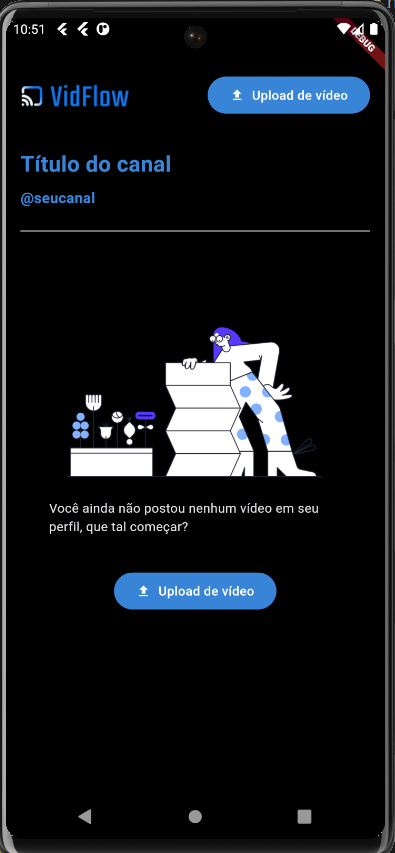

# Integrando APIs usando Getx

Este projeto é fruto do curso de 'Flutter: utilizando pacotes Getx para fazer integração de APIs' da plataforma ALURA

## Apresentação do Projeto
   
   VidFlow, se trata de um projeto de gerenciamento de vídeos onde se tem a necessidade de lidar com cadastro de usuários recebendo  nome, e-mail e senha pelo aplicativo, que será armazenado em um banco de dados.

   Essas informações serão utilizadas para realizar um login e por isso, também será necessário armazenar as informações da sessão.

   Também como objetivo teremos uma simulação de upload de vídeo onde será necessário inserir o titulo,link do vídeo e também uma thumbnail.

   Com o proposito de simular o serviço da API, é utilizada uma API local criada com Node.js.

   <p align="center">
  
  
  
   
</p>


## Requisitos
   - Flutter SDK
   - Node.js
   - npm (Node Package Manager)
   
  obs: meu projeto esta voltado para ambiente windows/android

## Instruções API

- Iniciando o banco de dados

O banco de dados é um arquivo chamado `db.json`. Ele precisa ser criado com a seguinte estrutura dentro da pasta **db**:

```json
{
  "users": [],
  "videos": []
}
```

- Rodando a API

É importante que você tenha em sua máquina NodeJS e NPM nas seguintes versões:

   - NodeJS: v20.5.0
   - NPM: 10.4.0

Depois instale os pacotes utilizando o seguinte comando:

```shell
npm install
```

> Aviso importante
>
> Pode ser que você precise rodar o comando acima como super usuário (sudo)

 Comando de start da API:

```shell
json-server ./db/db.json -m node_modules/json-server-auth

obs: no nosso caso, estaremos validando apartir do emulador android por isso necessita do ip local
json-server ./db/db.json -m ./node_modules/json-server-auth --watch --host <seu ip interno>

```

 - Conclusão

 A API deve estar rodando na porta **3000**!

    - requisições de usuário
       
       - cadastro de usuário
         http://<seu ip interno>:3000/register
       
       - autênticação
        http://<seu ip interno>:3000/login

    - requisições de video
       
       - envio de videos
         http://<seu ip interno>:3000/600/videos
        
         obs: necessário em content-type, o token recebido no cadastro do usuario.

      - listagem de videos
        
        http://localhost:3000/videos
        http://localhost:3000/600/videos?userId=1
       

## Descrição dos objetivos realizados a cada commit

 - Iniciando o projeto

   - Instalação das depêndencias do App assim como as da API node 
   - Como baixar uma API pré-desenvolvida do GitHub para usar o projeto;
   - Configurar corretamente a API, incluindo a instalação de dependências e a preparação do arquivo db.json;
   - Rodar a API localmente usando o comando específico no terminal;

- criando rotas da aplicação
   
   - Utilizar o Postman para fazer requisições à API e testar suas funcionalidades;
   - Identificar a estrutura e o propósito de cada rota dentro da aplicação, incluindo a autenticação e o gerenciamento de vídeos.

- Realizando registro do usuario

  - Criar um controller usando GetX para gerenciar o registro de usuários;
  - Separar a lógica de programação da View e colocá-la no controller para uma melhor organização do código;
  - Usar TextEditingController para gerenciar os inputs dos usuários e como limpar esses campos após o registro;
  - Fazer requisições HTTP para registrar além de como tratar as respostas do servidor;
  - Realizar a navegação entre telas usando o GetX, tanto no processo de registro 


- Implementando o login  

  - Usar TextEditingController para gerenciar os inputs dos usuários e como limpar esses campos após o registro;
  - Fazer requisições HTTP para registrar além de como tratar as respostas do servidor;
  - Realizar a navegação entre telas usando o GetX, tanto no processo de registro 

- Requisições http via getx  

  - Separar as requisições para uma API em uma camada de serviço dedicada, melhorando a organização e a manutenção do código;
 
- criando a classe VideosController

 - Implementar funções específicas para criação de vídeo e busca por usuário, seguindo os padrões e práticas recomendadas pela API;

 - Injetar a camada de serviço como dependência no controller de vídeo.

- Implementação de crete video e sua utilização

  - Implementar funções específicas para criação de vídeo e busca por usuário, seguindo os padrões e práticas recomendadas pela API;

  - Injetar a camada de serviço como dependência no controller de vídeo.

- Armazenando variaveis de sessão com GetStorage  

  - Instalar e inicializar o GetStorage, um pacote do GetX, para armazenamento de dados;

  - Armazenar dados, guardando e lendo informações utilizando o GetStorage, através de chaves e valores;
  
  - Salvar informações da sessão de login, como tokens e dados de usuário, usando o GetStorage para manter o usuário logado;
  
  - Buscar informações salvas no GetStorage para utilizar em diferentes partes do aplicativo, como na autenticação e na manipulação de vídeos;
  
  - Gerenciar dados, entendendo que o GetStorage não é um banco de dados, mas uma ferramenta para armazenamento de dados de forma persistente até que seja explicitamente limpo.

- apresentando transições e dialogs com Get

  - Adicionar animações de transição entre telas usando a biblioteca GetX, tanto de forma global quanto individualmente;
  
  - Criar dialogs de alerta ou informação de forma simples com GetX, incluindo título e texto;
  
  - Adicionar botões aos dialogs, como um botão de fechar, usando widgets e a função Get.back() para fechar o dialog;

  - Utilizar animações e dialogs para tornar a aplicação mais interativa e melhorar a experiência do usuário.  